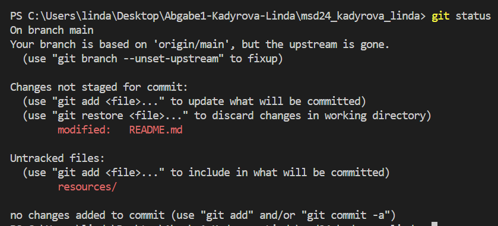
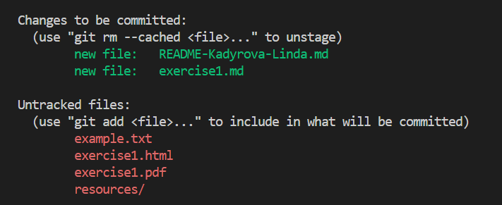
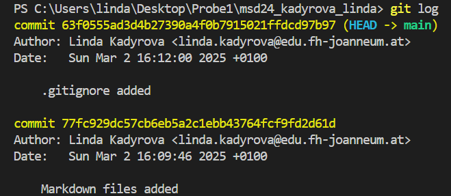
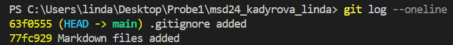
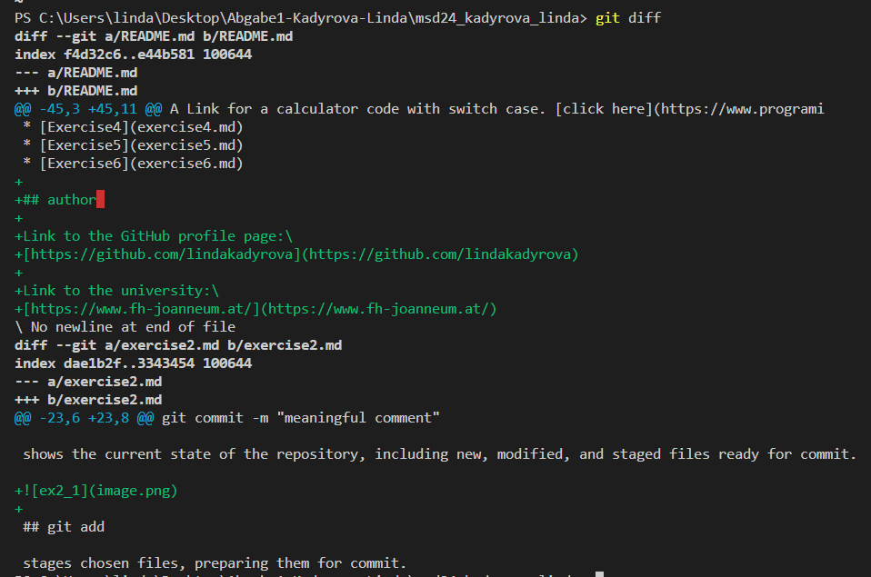
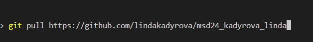
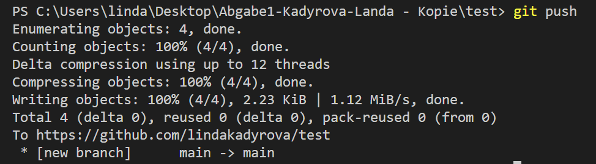

# GIT commands

## git config

to configurate an email and name for global repository usage
```
name configuration: git config --local user.name "Your Name"
email configuration: git config --local user.email "your.email@example.com"
```
## git init

creates local repository

## git commit

records changes to the repository, creating a snapshot of the current state of tracked files.

```
git commit -m "meaningful comment"
```

## git status

shows the current state of the repository, including new, modified, and staged files ready for commit.



## git add

stages chosen files, preparing them for commit.

```
git add . or git add * stages all changes in the current working directory.
git add filename stages only the given file
```


>the green ones are now staged

## git log

| command | example | description |
|----------|----------|----------|
| git log |  | displays a list of commits, showing details like commit ID, author, date, and commit message. |
| git log --oneline |  |  shows a simplified, one-line commit history. |


## git diff

shows the changes between the working directory and the staging area



## git pull

fetches and merges changes from a remote repository into the current branch

```
git pull URL 
```


## git push

uploads local commits to a remote repository

```
git push 
```


