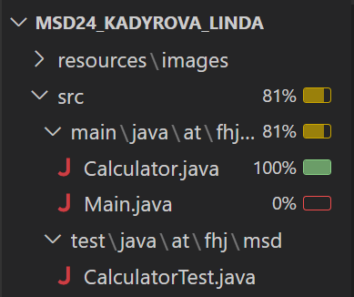

## Description of the test cases

### Addition Tests
The first test checks the add method using two positive numbers (3 and 2), ensuring that the result is 5.0.

The second test checks the add method when both input values are zero, verifying that the result is 0.0.

The last test verifies the behavior of the add method when adding a negative number (-3) to a positive number (4), ensuring the result is 1.0.

### Subtraction Tests
This test checks the minus method with two positive numbers (6 and 3), ensuring that subtracting 3 from 6 results in 3.0.

The next test checks the minus method when both numbers are negative (-6 and -3), ensuring the result is -3.0.

The third test verifies the minus method when one of the numbers is zero, confirming that subtracting 0 from -6 results in -6.0.

### Division Tests
This test checks the divide method with two positive numbers (6 and 2), verifying that dividing 6 by 2 results in 3.0.

This test checks the divide method with a negative dividend (-6) and a positive divisor (2), ensuring the result is -3.0.

This test checks how the divide method handles division by zero. It confirms that dividing a negative number by 0.0 returns Double.NEGATIVE_INFINITY. I found this information at the following link: https://www.baeldung.com/java-division-by-zero

### Multiplication Tests
The first test checks the multiply method with two positive numbers (4 and 3), ensuring that multiplying 4 by 3 results in 12.0.

The second test checks the multiply method when one number is negative (-5) and the other is positive (6), verifying that the result is -30.0.

The third test checks the multiply method when one of the numbers is zero, ensuring that multiplying any number by 0 results in 0.0.

